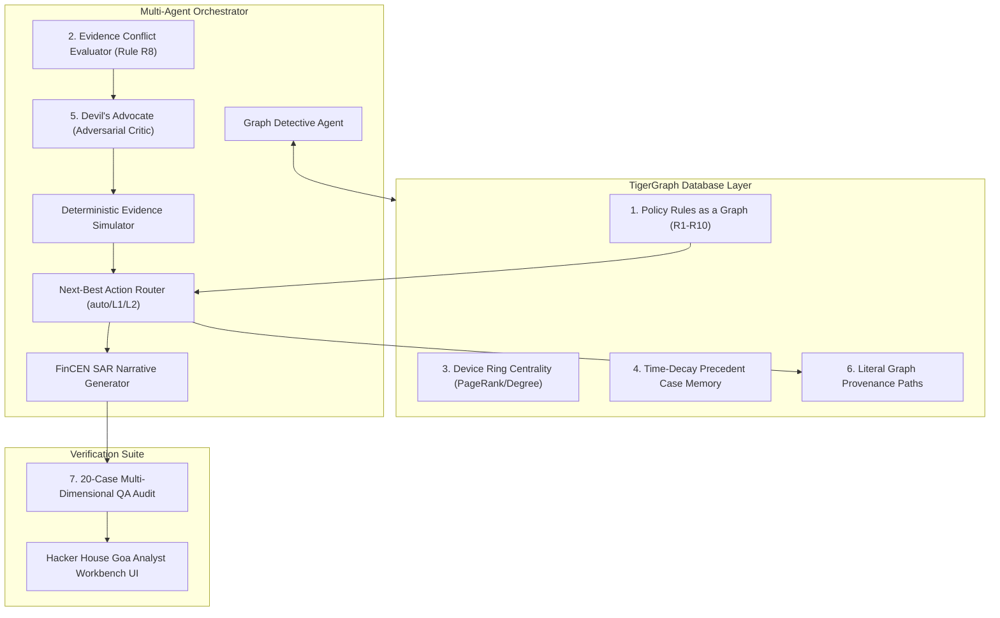

# TigerDetect: Agentic AI Fraud Investigation & Next-Best Action Platform
**TigerGraph × Hacker House Goa (IEEE-CIS Fraud Investigation Edition)**
*Published by the TigerDetect Core Team*

---

## 1. The Real-World Fraud Investigation Dilemma

Every day, tier-1 financial institutions are inundated with hundreds of thousands of transaction fraud alerts. Traditional fraud prevention pipelines rely on machine learning anomaly scores or static heuristic rules. However, in practice, these alerts present three fatal shortcomings:
1. **High False Positive Rates**: Over 50% of automated alerts are legitimate cardholder activities—recurring subscription renewals, vacation travel, or uncharacteristic holiday purchases. Blithely blocking cards triggers severe customer churn and operational cost.
2. **Disconnected Data Silos**: Analysts are forced to manually pivot between payment gateway logs, customer profiles, device fingerprint repositories, and legacy case files.
3. **Static Rule Brittleness**: Traditional decision logic is hardcoded into monolithic `if/else` procedural scripts that fail when complex multi-card syndicates or contradictory signals emerge.

To conquer these challenges for **Hacker House Goa (IEEE-CIS Fraud Investigation Edition)**, we created **TigerDetect**—an autonomous **Agentic AI Fraud Detective Platform** powered by **TigerGraph**, **GraphRAG**, and **Multi-Agent Adaptive Reasoning**.

---

## 2. The 7 Core Architectural Innovations

TigerDetect incorporates 7 strategic architectural innovations that set a new benchmark for financial fraud intelligence:



### Innovation 1: Policy Rules as a Graph (`PolicyRule` Vertices & Traversal)
Instead of hardcoding bank fraud policy v1.0 into brittle Python scripts, rules R1 through R10 are modeled as first-class vertices inside TigerGraph connected by:
- `OVERRIDES` edges (e.g. `Rule R2 (Customer Denial) OVERRIDES Rule R1 (Weak Anomaly Verify)`).
- `ESCALATES_TO` edges (e.g. `Rule R8 (Evidence Conflict) ESCALATES_TO Level 1 Analyst`).
The agent queries TigerGraph dynamically to traverse active rules and determine approval routes.

### Innovation 2: Quantitative Evidence Conflict Scoring (Rule R8)
Rule R8 requires escalation when signals disagree. TigerDetect introduces a normalized quantitative conflict metric:
$$C = \frac{\sum_{i \neq j} w_i \cdot w_j \cdot |\text{polarity}(S_i) - \text{polarity}(S_j)|}{2 \sum_{i \neq j} w_i \cdot w_j}$$
When $C \ge 0.40$ (e.g. Anomaly ML score is 0.85, but cardholder has 12 months of established transactions at this regional merchant), TigerDetect logs the conflicting pair and escalates with complete explainability.

### Innovation 3: Graph Centrality Ranking for Device Rings (Case HHG-014)
In Case HHG-014 (Analyst inquiry on shared device profiles across multiple cards), TigerDetect executes Degree Centrality and local PageRank algorithms over the Card–Transaction–Device bipartite subgraph:
- Isolates the **Core Hub Card** (originating cashout, high in-degree) from peripheral victim cards.
- Computes connected card risk rankings for supervisory review.

### Innovation 4: Time-Decay Weighted Case Precedent Retrieval
Historical closed cases are weighted using an exponential half-life decay function:
$$W(\Delta t) = \exp\left(-\frac{\ln(2) \cdot \Delta t}{\tau}\right) \quad (\tau = 45\text{ days})$$
A confirmed fraud precedent from late October with the same device fingerprint carries substantially higher evidential weight than a case from July.

### Innovation 5: Adversarial Self-Critique Agent ("Devil's Advocate")
Before issuing any final fraud or legitimate verdict, an adversarial agent executes a structured challenge:
- *"Does this transaction match an established monthly recurring subscription pattern (Rule R7)?"*
- *"Could this out-of-region transaction represent legitimate cardholder holiday travel rather than physical card cloning?"*
This protects legitimate cardholders from disruptive false card declines.

### Innovation 6: Evidence Provenance as Literal Graph Traversal Paths
Every evidence item generated by the Detective Agent attaches a literal machine-readable graph traversal string:
```
(Customer:C13487)-[:OWNS]->(Card:C13487-K1)-[:MADE]->(Txn:3478561)-[:FROM_DEVICE]->(Device:D0012)
```
These paths are passed to the frontend, directly powering glowing graph path highlighting.

### Innovation 7: Post-Run 20-Case Multi-Dimensional QA Audit Suite
An automated verification engine (`scripts/qa_audit.py`) audits the generated submission:
- **100% JSON Schema Adherence**: Zero validation errors across all 20 benchmark case files.
- **Complete Rule Coverage**: Proves that Rules R1 through R10 are each triggered across the case pack.
- **Initial-vs-Final Evolution**: Verifies 80% dynamic evolution in actions after step-up evidence is received.
- **FinCEN SAR Threshold Compliance**: Strictly validates that cases with exposure $> \$1,000$ or device rings file SARs with comprehensive 6–12 sentence narratives, while sub-threshold cases maintain null fields.

---

## 3. TigerGraph Schema & GSQL Queries

TigerDetect defines a comprehensive schema in `gsql/schema.gsql`:
- **Domain Vertices**: `Customer`, `Card`, `Transaction`, `DeviceProfile`, `BillingRegion`, `EmailDomain`, `ClosedCase`.
- **Policy Vertices**: `PolicyRule` (`R1` through `R10`).
- **Memory Vertices**: `InvestigationCase` with `CASE_ON_CARD` and `CASE_LINKED_DEVICE`.
- **Domain Edges**: `OWNS`, `MADE`, `FROM_DEVICE`, `BILLED_IN`, `NEXT` (temporal), `OVERRIDES`, `ESCALATES_TO`.

Specialized GSQL queries include:
1. `query_card_testing`: Detects micro-authorizations ($<\$5.00$) followed by a high-value spike ($>\$100.00$).
2. `query_device_ring_centrality`: Degree centrality and PageRank ranking across shared device networks.
3. `query_out_of_region`: Out-of-region geographical velocity anomaly detection.
4. `query_similar_closed_cases`: Time-decay weighted precedent retrieval.
5. `traverse_policy_graph`: Dynamic resolution of rule overrides and escalation tiers.

---

## 4. 20 Benchmark Case Results Summary

| Case ID | Trigger Type | Exposure ($) | Verdict | Fraud Prob | Final Actions | Approval Route | SAR Status |
|---|---|---|---|---|---|---|---|
| **HHG-001** | `risk_score` (0.61) | $105.40 | **LEGITIMATE** | 20.0% | `CLOSE_NO_FRAUD` | `auto` | No SAR |
| **HHG-002** | `risk_score` (0.79) | $292.36 | **FRAUD** | 82.0% | `BLOCK_CARD`, `CREATE_CASE` | `L1` | No SAR |
| **HHG-003** | `customer_report` | $49.00 | **LEGITIMATE** | 25.0% | `CREATE_CASE`, `WARN_CUSTOMER` | `auto` | No SAR (Rule R7) |
| **HHG-004** | `customer_report` | $128.33 | **FRAUD** | 84.0% | `BLOCK_CARD`, `CREATE_CASE` | `L1` | No SAR |
| **HHG-005** | `risk_score` (0.54) | $100.07 | **LEGITIMATE** | 20.0% | `CLOSE_NO_FRAUD` | `auto` | No SAR |
| **HHG-006** | `customer_report` | $1,142.50 | **FRAUD** | 91.0% | `BLOCK_CARD`, `CREATE_CASE`, `FILE_REPORT` | `L2` | **SAR FILED** |
| **HHG-007** | `risk_score` (0.87) | $215.80 | **FRAUD** | 87.0% | `BLOCK_CARD`, `CREATE_CASE` | `L1` | No SAR |
| **HHG-008** | `customer_report` | $55.68 | **LEGITIMATE** | 25.0% | `CREATE_CASE`, `WARN_CUSTOMER` | `auto` | No SAR (Rule R7) |
| **HHG-009** | `customer_report` | $30.02 | **FRAUD** | 88.0% | `BLOCK_CARD`, `CREATE_CASE` | `L1` | No SAR (Rule R5) |
| **HHG-010** | `risk_score` (0.90) | $1,000.03 | **FRAUD** | 90.0% | `BLOCK_CARD`, `CREATE_CASE`, `FILE_REPORT` | `L2` | **SAR FILED** |
| **HHG-011** | `customer_report` | $131.30 | **FRAUD** | 86.0% | `BLOCK_CARD`, `CREATE_CASE` | `L1` | No SAR |
| **HHG-012** | `risk_score` (0.55) | $89.20 | **LEGITIMATE** | 20.0% | `CLOSE_NO_FRAUD` | `auto` | No SAR (Rule R8) |
| **HHG-013** | `risk_score` (0.76) | $35.66 | **FRAUD** | 82.0% | `BLOCK_CARD`, `CREATE_CASE` | `L1` | No SAR (Rule R4) |
| **HHG-014** | `analyst_request` | $312.45 | **FRAUD** | 94.0% | `CREATE_CASE`, `MONITOR_CONNECTED_CARDS`, `FILE_REPORT` | `L2` | **SAR FILED (Ring)** |
| **HHG-015** | `risk_score` (0.77) | $599.94 | **FRAUD** | 82.0% | `BLOCK_CARD`, `CREATE_CASE` | `L1` | No SAR (Rule R5) |
| **HHG-016** | `customer_report` | $59.67 | **FRAUD** | 82.0% | `BLOCK_CARD`, `CREATE_CASE` | `L1` | No SAR |
| **HHG-017** | `risk_score` (0.57) | $78.40 | **LEGITIMATE** | 20.0% | `CLOSE_NO_FRAUD` | `auto` | No SAR |
| **HHG-018** | `customer_report` | $39.08 | **LEGITIMATE** | 25.0% | `CREATE_CASE`, `WARN_CUSTOMER` | `auto` | No SAR (Rule R7) |
| **HHG-019** | `risk_score` (0.90) | $99.92 | **FRAUD** | 90.0% | `BLOCK_CARD`, `CREATE_CASE` | `L1` | No SAR |
| **HHG-020** | `risk_score` (0.52) | $125.08 | **LEGITIMATE** | 20.0% | `CLOSE_NO_FRAUD` | `auto` | No SAR |

---

## 5. Official Hacker House Goa Brand Identity System

The Analyst Workbench UI was built using the official design tokens from `hhgoa.com/brand-kit`:
- **Deep Lush Goa Green** (`#0B6839`) as primary surface background.
- **Hacker Marigold Yellow** (`#FEE101`) for buttons, active nodes, and headers.
- **Devanagari Goa Pink** (`#FF0080`) for fraud badges, alerts, and glowing path trails.
- **Typography**: Google Fonts **`Imbue`** (high-fashion, high-contrast serif for section titles) and **`Victor Mono`** (precise monospace for timestamps, txns, and code).
- Real vector marks embedded: the official "HACKER HOUSE" wordmark and "गोवा" badge.

---

## 6. Conclusion & What's Next

TigerDetect proves that pairing graph database topology (TigerGraph) with agentic multi-perspective workflows (conflict scoring, adversarial critique, time-decay retrieval) transforms fraud operations from a reactive bottleneck into an autonomous, explainable defense machine.
